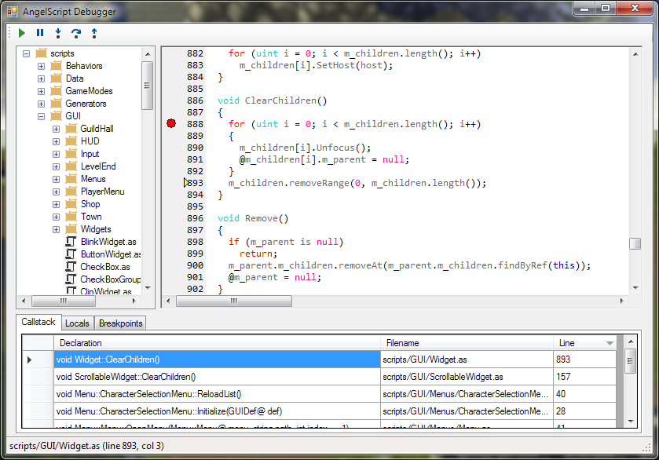

# asdbg

A remote debugger for AngelScript. Currently in very early stages of development.



## Implementation

To implement the debugger into the host application, include `asdbg.h`. Also, in 1 .cpp file, include it while `ASDBG_IMPL` is defined.

```cpp
#define ASDBG_IMPL
#include "asdbg.h"
```

Then, before the first execution of a script context, initialize the debugger:

```cpp
asIScriptContext* ctx = engine->CreateContext();
dbg::Initialize(ctx);
```

Next, define any encoders you may need for variable inspection. An encoder takes a pointer and returns a string representation. Optionally, a decoder takes a pointer and a string representation, and you have to decode the string representation into the pointer. For example, a `std::string` encoder (for the default `ScriptString` addon) looks like this:

```cpp
dbg::Encoder(engine->GetTypeIdByDecl("string"), [](void* ptr) {
  return *(std::string*)ptr;
}, [](void* ptr, const char* set) {
  *(std::string*)ptr = set;
});
```

When your program is shutting down, call `dbg::Release()` before the context is released.

```cpp
dbg::Release();
ctx->Release();
engine->Release();
```

## Goals

- [x] Single-header implementation in host application
- [x] Stepping through code with a visual code view
  - [x] Step into
  - [x] Step over
  - [x] Step out
- [x] Breakpoints
- [ ] View local variables
  - [x] Built-in types
  - [x] Custom types
  - [ ] Arrays
  - [ ] Dictionaries
- [x] View stack trace
- [ ] Inspect each frame individually

## License

MIT license:

Copyright (c) github.com/codecat 2017 - 2018
